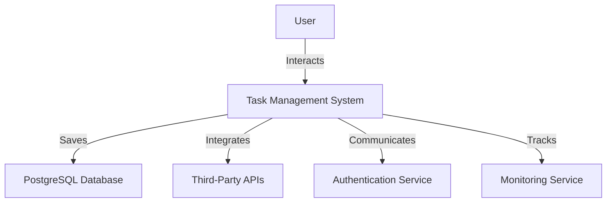
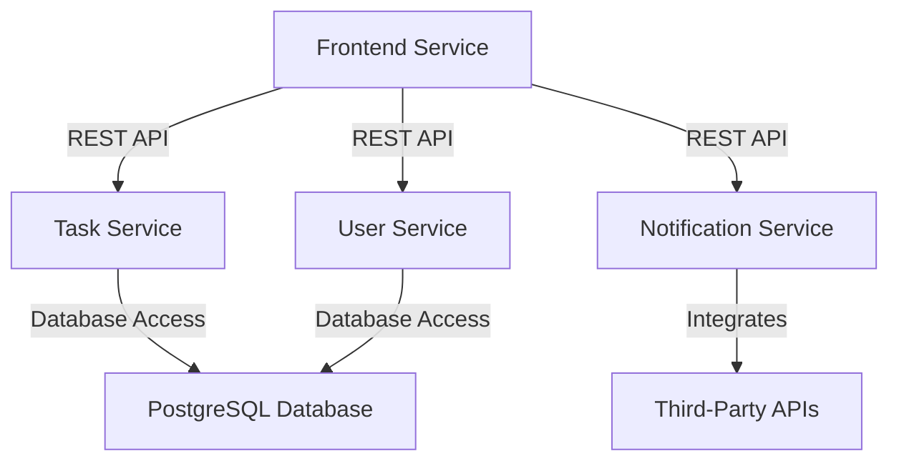
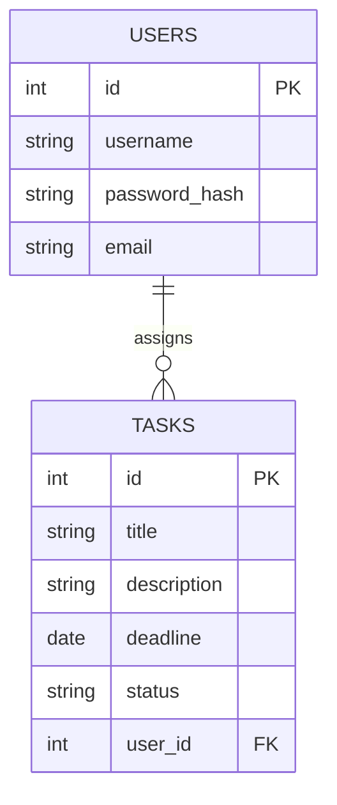
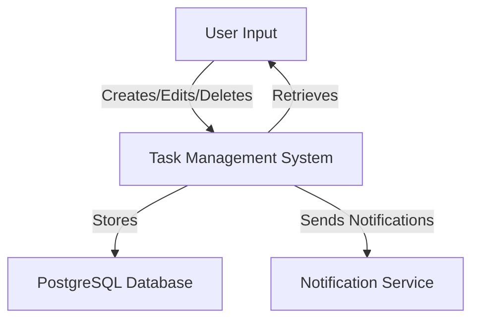
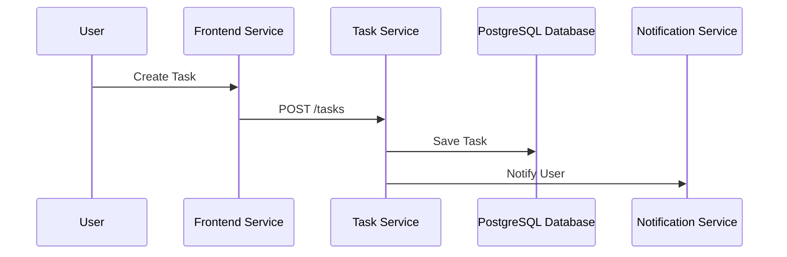
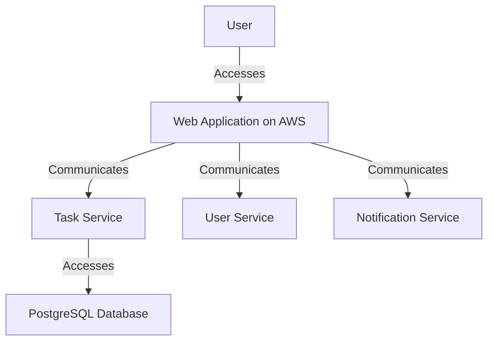

# Updated High Level Design Document for Task Management System

## 1. Overview
The purpose of this document is to outline the high-level architecture for a web-based task management system designed to enhance operational efficiency, improve performance, and ensure reliable task tracking. This system will provide functionalities for creating, editing, deleting, and tracking tasks, catering to both individual contributors and team leaders.

## 2. System Context
### 2.1 Diagram with Explanation

**Explanation**: The diagram illustrates the system context where users interact with the Task Management System, which communicates with a PostgreSQL database for data storage, integrates with third-party APIs for additional functionalities, and utilizes an authentication service for user security. A monitoring service is also included to ensure system performance and reliability.

## 3. Application Architecture
### 3.1 Diagram and Explanation

**Explanation**: This architecture diagram represents a microservices-based approach where the frontend service communicates with various backend services (Task Service, User Service, Notification Service) through REST APIs. Each service interacts with a shared PostgreSQL database, while the Notification Service integrates with third-party APIs for notifications.

### 3.2 List of Microservices
#### 3.2.1 Frontend Service
- **Short Description**: User interface for the task management system.
- **Detailed Functionality**: Provides a responsive web interface for users to create, edit, delete, and track tasks.
- **List of Components**: Streamlit components for UI rendering.

#### 3.2.2 Task Service
- **Short Description**: Manages task-related operations.
- **Detailed Functionality**: Handles task creation, editing, deletion, and tracking.
- **List of Components**: FastAPI for RESTful API, PostgreSQL for data storage.

#### 3.2.3 User Service
- **Short Description**: Manages user authentication and profiles.
- **Detailed Functionality**: Handles user registration, login, and profile management.
- **List of Components**: FastAPI for RESTful API, PostgreSQL for user data storage.

#### 3.2.4 Notification Service
- **Short Description**: Manages notifications and reminders.
- **Detailed Functionality**: Sends notifications for task deadlines and reminders.
- **List of Components**: FastAPI for RESTful API, integration with third-party APIs for notifications.

## 4. Data Architecture
### 4.1 Logical Data Model with Explanation

**Explanation**: The logical data model illustrates the relationship between users and tasks. Each user can have multiple tasks assigned to them, with relevant attributes for both entities.

### 4.2 Data Flow Diagram with Explanation

**Explanation**: The data flow diagram depicts how user inputs are processed by the Task Management System, stored in the PostgreSQL database, and how notifications are sent through the Notification Service.

## 5. Integration Architecture
### 5.1 List of Requirements
- **Internal Communication**: Microservices will communicate via RESTful APIs.
- **External Communication**: The Notification Service will integrate with third-party APIs for sending notifications.

### 5.2 Interaction Diagram with Explanation

**Explanation**: The interaction diagram illustrates the sequence of operations when a user creates a task. The frontend service communicates with the task service, which saves the task in the database and notifies the user through the notification service.

### 5.3 API Specification
- **Task Service APIs**:
  - `POST /tasks`: Create a new task.
  - `GET /tasks`: Retrieve all tasks.
  - `PUT /tasks/{id}`: Update a task.
  - `DELETE /tasks/{id}`: Delete a task.
  
- **User Service APIs**:
  - `POST /users`: Register a new user.
  - `GET /users/{id}`: Retrieve user profile.
  
- **Notification Service APIs**:
  - `POST /notifications`: Send a notification.

## 6. Technology Stack
### 6.1 List of Technology
- **Streamlit**: A framework for building web applications in Python. Chosen for its ease of use and rapid development capabilities for the frontend.
- **FastAPI**: A modern web framework for building APIs with Python. Selected for its performance and ease of use in creating RESTful services.
- **PostgreSQL**: A robust database engine. Chosen for its scalability and performance to handle the expected user load.
- **AWS**: Cloud service provider for hosting the application. Selected for its scalability and reliability.

## 7. Deployment Architecture
### 7.1 Diagram and Explanation

**Explanation**: The deployment architecture diagram shows how users access the web application hosted on AWS, which communicates with various microservices (Task Service, User Service, Notification Service) and accesses the PostgreSQL database.

## 8. Architecture Decisions
### 8.1 Architecture Decisions Document
- **Context**: The need for a scalable and efficient task management system.
- **Alternatives**: Monolithic architecture, serverless architecture.
- **Decisions**: Adopted microservices architecture for better scalability and maintainability.
- **Consequences**: Increased complexity in deployment and management, but improved flexibility and scalability.

- **Context**: Choice of database technology.
- **Alternatives**: SQLite, MySQL, MongoDB.
- **Decisions**: Chose PostgreSQL for its robustness and ability to handle high concurrency.
- **Consequences**: Improved performance and scalability, but requires more resources compared to SQLite.

- **Context**: Inter-service communication.
- **Alternatives**: Direct REST calls, service mesh, circuit breaker patterns.
- **Decisions**: Implemented RESTful APIs with circuit breaker patterns for resilience.
- **Consequences**: Enhanced fault tolerance and reliability in service communication.

- **Context**: Security measures.
- **Alternatives**: Basic authentication, OAuth, JWT.
- **Decisions**: Implemented JWT for user authentication and data encryption.
- **Consequences**: Improved security posture, but requires additional implementation effort.

This updated high-level design document provides a comprehensive overview of the architecture for the task management system, ensuring that all components are well-defined and aligned with the requirements outlined in the SRS. The incorporation of review comments has enhanced the professionalism, clarity, and completeness of the document.