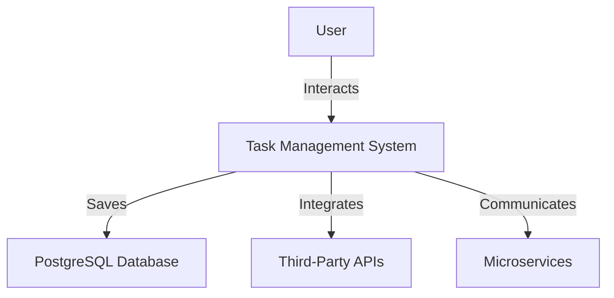
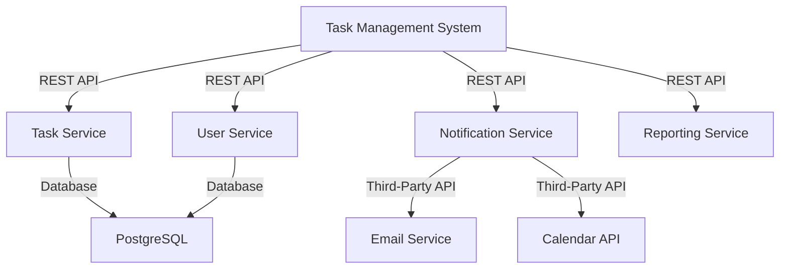
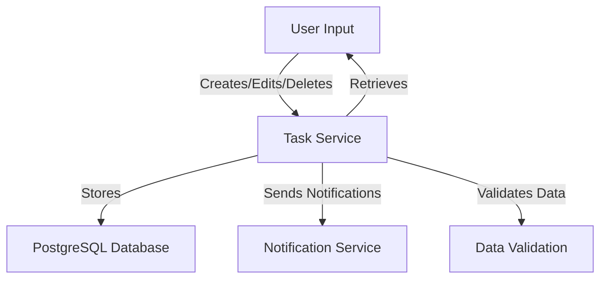
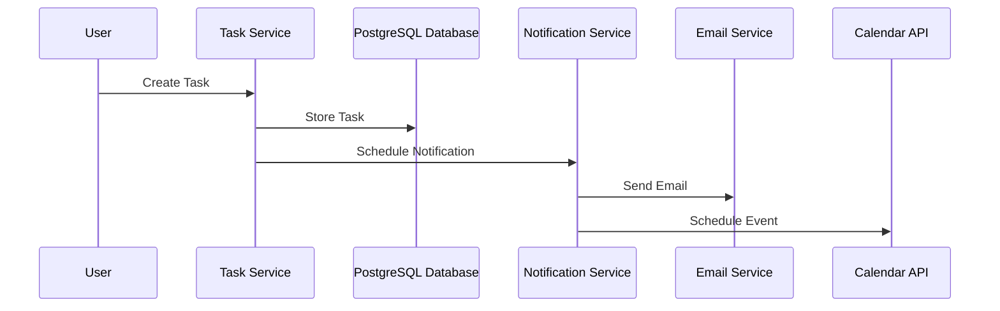
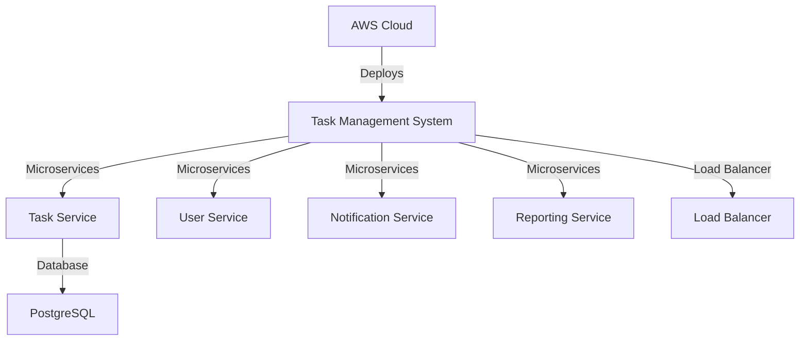

# Updated High Level Design Document for Task Management System

## 1. Overview
The purpose of this document is to outline the architecture and design of a web-based task management system aimed at enhancing operational efficiency, improving performance, and ensuring reliable task tracking for users in the banking sector. The system will provide functionalities for task creation, editing, deletion, tracking, and collaboration among team members, including task categorization and commenting on tasks.

## 2. System Context
### 2.1 Diagram and Purpose

**Purpose**: This diagram illustrates the interaction between users and the task management system, highlighting the integration with a robust database and third-party APIs, as well as the internal microservices architecture.

## 3. Application Architecture
### 3.1 Diagram

### 3.2 List of Microservices
#### 3.2.1 Task Service
- **Short Description**: Manages all task-related operations.
- **Detailed Functionality**: Create, edit, delete tasks; set deadlines and reminders; categorize tasks; assign tasks to team members; track progress; allow commenting on tasks; includes data validation and error handling.
- **List of Components**: 
  - Frontend: Task management UI (Streamlit)
  - Backend/API: FastAPI for RESTful services
  - Database: PostgreSQL

#### 3.2.2 User Service
- **Short Description**: Handles user authentication and management.
- **Detailed Functionality**: User registration, login, profile management, and multi-factor authentication; ensures secure management of user data during API interactions.
- **List of Components**: 
  - Frontend: User management UI (Streamlit)
  - Backend/API: FastAPI for RESTful services
  - Database: PostgreSQL

#### 3.2.3 Notification Service
- **Short Description**: Sends notifications and reminders to users.
- **Detailed Functionality**: Manage notifications for task deadlines and updates, including task reminders triggered by deadlines; implements Circuit Breaker design pattern for third-party API failures; includes retry logic and fallback mechanisms for enhanced reliability.
- **List of Components**: 
  - Backend/API: FastAPI for RESTful services
  - Third-Party API: Email Service, Calendar API

#### 3.2.4 Reporting Service
- **Short Description**: Generates reports on task progress and performance.
- **Detailed Functionality**: Provide insights into task completion rates and team performance; includes performance metrics monitoring and reporting.
- **List of Components**: 
  - Backend/API: FastAPI for RESTful services
  - Database: PostgreSQL

## 4. Data Architecture
### 4.1 Logical Data Model
- **Entities**: User, Task, Notification
- **Relationships**: 
  - A User can have multiple Tasks.
  - A Task can have multiple Notifications.
  - A Task can have multiple Comments.

### 4.2 Data Flow Diagram

*Descriptions for DFDs: The DFDs illustrate the flow of data within the task management system, showing how user inputs are processed and stored in the database, how notifications are sent, and how data validation is performed.*

## 5. Integration Architecture
### 5.1 List of Requirements
- **Internal Communication**: 
  - Task Service communicates with User Service for user-related operations.
  - Notification Service communicates with Task Service to send reminders based on task deadlines.
  - Implement retry logic for inter-service communication failures.
- **External Communication**: 
  - Notification Service integrates with third-party APIs for email and calendar notifications.

### 5.2 Interaction Diagram

### 5.3 API Specification
- **Task Service API**:
  - `POST /tasks`: Create a new task
  - `GET /tasks`: Retrieve all tasks
  - `PUT /tasks/{id}`: Update a task
  - `DELETE /tasks/{id}`: Delete a task
  - **Error Handling**: Returns appropriate error codes and messages for invalid inputs or processing errors.
- **User Service API**:
  - `POST /users`: Register a new user
  - `GET /users/{id}`: Retrieve user profile
  - `POST /login`: User login
  - **Error Handling**: Returns error codes for authentication failures.
- **Notification Service API**:
  - `POST /notifications`: Create a new notification
  - **Error Handling**: Includes scenarios for failed notifications and retries.

## 6. Technology Stack
### 6.1 List of Technology
- **Python (FastAPI)**: For building RESTful APIs; chosen for its performance and ease of use.
- **Streamlit**: For creating the user interface; selected for rapid development and ease of deployment.
- **PostgreSQL**: Robust database for storing task and user data; chosen for its scalability and performance.
- **Swagger**: For API documentation; selected for its ability to provide interactive API documentation.
- **AWS**: For cloud deployment; chosen for its extensive services and global reach.

## 7. Deployment Architecture
### 7.1 Diagram

*This diagram depicts the deployment model of the task management system on AWS, showcasing the microservices architecture with load balancing and failover strategies for high availability.*

## 8. Architecture Decisions
### 8.1 Technology Choice
- **Context**: The need for a scalable and efficient task management system.
- **Alternatives**: Other frameworks like Django or Node.js.
- **Decision**: Chose FastAPI for its performance and ease of use.
- **Consequences**: FastAPI allows for rapid development and high performance, suitable for the expected load.

### 8.2 Database Engine
- **Context**: Requirement for a robust database to handle expected user load.
- **Alternatives**: SQLite, MySQL.
- **Decision**: Chose PostgreSQL for its scalability and performance.
- **Consequences**: PostgreSQL can handle a larger number of concurrent users and provides better performance under load.

### 8.3 Cloud Choice
- **Context**: Need for a reliable cloud provider.
- **Alternatives**: Google Cloud, Azure.
- **Decision**: Chose AWS for its extensive services and global reach.
- **Consequences**: AWS provides scalability and reliability, ensuring high availability.

### 8.4 Security Measures
- **Context**: Requirement for data security and compliance.
- **Alternatives**: Various security frameworks.
- **Decision**: Implemented data encryption (AES-256) and multi-factor authentication; user data securely managed during API interactions.
- **Consequences**: Enhances security but may add complexity to user authentication processes.

### 8.5 API Specification Completeness
- **Context**: Need for clear API behavior.
- **Alternatives**: Basic API documentation.
- **Decision**: Include error handling responses and status codes for each endpoint; ensure API documentation includes examples of request and response payloads.
- **Consequences**: Provides a clearer understanding of API behavior for developers.

### 8.6 Performance Metrics
- **Context**: Need to meet non-functional requirements.
- **Alternatives**: No performance metrics.
- **Decision**: Include expected response times and throughput for microservices; specific thresholds for response times and load testing strategies.
- **Consequences**: Ensures that the system meets performance expectations.

### 8.7 Documentation
- **Context**: Need for up-to-date API documentation.
- **Alternatives**: Manual updates.
- **Decision**: Ensure that the API documentation (Swagger) is kept up-to-date with any changes made during development.
- **Consequences**: Maintains clarity for future developers.

This updated High-Level Design Document incorporates all review comments and provides a comprehensive overview of the architecture and design decisions for the task management system, ensuring alignment with the specified requirements and objectives.