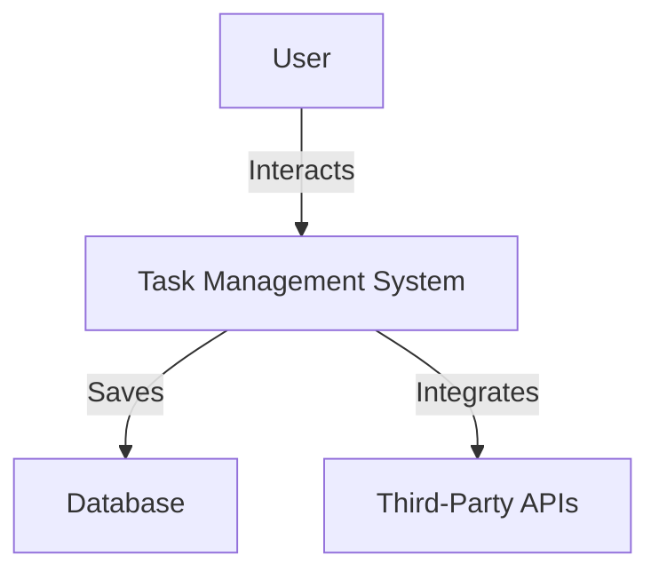
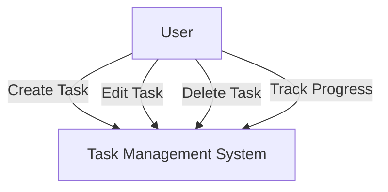
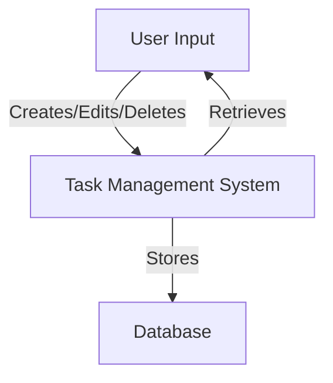

# Updated Software Requirements Specification (SRS) for Task Management System

## 1. Introduction
This Software Requirements Specification (SRS) document outlines the requirements for a web-based task management system designed to enhance operational efficiency, improve performance, and ensure the reliability of task tracking for users. The system will cater to the needs of workers and managers, providing them with tools to manage tasks effectively.

The target audience includes both individual contributors (workers) who need to manage their own tasks and team leaders (managers) who require oversight of team performance and task allocation. The intended impact of this system is to streamline task management processes, reduce time spent on administrative tasks, and improve overall productivity within teams.

### 1.1 Purpose
The purpose of this document is to define the functional and non-functional requirements for the task management system. It aims to provide a clear understanding of the system's capabilities, ensuring that all stakeholders have a common understanding of the project objectives.

### 1.2 Scope
The task management system will include the following features and functionalities:
- Create, edit, and delete tasks
- Set deadlines and reminders
- Categorize tasks
- Assign tasks to team members
- Track progress
- Share tasks with others
- Comment or add notes to tasks
- View tasks in different formats
- Search and filter tasks

**Exclusions**: The project will not include features for time tracking or billing, nor will it support integration with project management tools outside of the specified third-party APIs. The specific third-party APIs to be integrated will be detailed in the software interfaces section.

**Assumptions**: Users are assumed to have basic computer skills and internet access.

**Limitations**: The system will not support offline access, and it will not provide advanced reporting features beyond basic task tracking.

## 2. System Overview
The task management system is a web-based tool designed to facilitate task organization and collaboration among team members. It will provide a user-friendly interface for managing tasks, improving overall productivity.

### 2.1 Personas
The primary user personas for the system are:
- **Workers**: Require a straightforward interface to manage their tasks, set reminders, and track progress.
- **Managers**: Need tools to assign tasks, monitor team performance, and ensure deadlines are met.

### 2.2 Assumptions and Dependencies
- Users are assumed to have basic computer skills and internet access.
- The system will depend on reliable internet connectivity and may integrate with third-party tools for enhanced functionality.
- Potential risks include changes in third-party API availability and user resistance to adopting new technology, which could impact project success. The identified risks may affect the project timeline and deliverables.

### 2.3 System Constraints
The system may face limitations such as:
- Dependency on third-party APIs for certain functionalities, which may introduce risks if those APIs change or become unavailable.
- User resistance to adopting new technology, which could affect the overall success of the implementation.

## 3. Functional Requirements
The following are the key features and their associated use cases for the task management system.

### 3.1 Feature: Task Management
#### 3.1.1 Use Case: Create New Task
- **Actors**: Workers, Managers
- **Preconditions**: User is logged into the system.
- **Postconditions**: A new task is created and saved in the system.
- **Steps**:
  1. User navigates to the task creation page.
  2. User inputs task details (title, description, deadline).
  3. User categorizes the task (e.g., work, personal).
  4. User assigns the task to themselves or another team member.
  5. User submits the task for creation.

#### 3.1.2 Functionalities:
- Users can input task details (title, description, deadline).
- Users can categorize tasks (e.g., work, personal).
- Users can assign tasks to themselves or other team members.

### 3.2 Feature: Task Editing
#### 3.2.1 Use Case: Edit Existing Task
- **Actors**: Workers, Managers
- **Preconditions**: User has access to the task they wish to edit.
- **Postconditions**: The task is updated with new information.
- **Steps**:
  1. User navigates to the task they wish to edit.
  2. User modifies task details.
  3. User changes task status (e.g., in progress, completed).
  4. User submits the changes.

#### 3.2.2 Functionalities:
- Users can modify task details.
- Users can change task status (e.g., in progress, completed).

### 3.3 Feature: Task Deletion
#### 3.3.1 Use Case: Delete Task
- **Actors**: Workers, Managers
- **Preconditions**: User has access to the task they wish to delete.
- **Postconditions**: The task is removed from the system.
- **Steps**:
  1. User navigates to the task they wish to delete.
  2. User confirms the deletion action.
  3. The task is permanently removed from the system.

#### 3.3.2 Functionalities:
- Users can delete tasks permanently.

### 3.4 Feature: Task Tracking
#### 3.4.1 Use Case: Track Task Progress
- **Actors**: Workers, Managers
- **Preconditions**: User has tasks assigned to them or their team.
- **Postconditions**: User can view the status of tasks.
- **Steps**:
  1. User navigates to the task tracking page.
  2. User views tasks in different formats (list, calendar).
  3. User filters tasks based on status, category, or assignee.

#### 3.4.2 Functionalities:
- Users can view tasks in different formats (list, calendar).
- Users can filter tasks based on status, category, or assignee.

## 4. Non-Functional Requirements (NFRs)
### 4.1 Performance
- The system should respond to user actions within 2 seconds under normal load.

### 4.2 Scalability
- The system should support up to 1000 concurrent users without performance degradation.

### 4.3 Security
- User data must be encrypted both in transit and at rest.
- Additional security measures will include multi-factor authentication and regular security audits.

### 4.4 Availability and Reliability
- The system should have an uptime of 99.9% and include recovery protocols for data loss.

### 4.5 Usability
- The user interface should be intuitive and require minimal training for new users.
- Usability metrics will include user satisfaction ratings and task completion times.

### 4.6 Compliance and Legal Requirements
- The system must comply with data protection regulations such as GDPR and ensure user data is handled according to legal standards.

## 5. External Interface Requirements
### 5.1 User Interfaces
- The system will feature a responsive design that adapts to various devices (desktop, tablet, mobile).
- The expected user experience will prioritize accessibility and ease of navigation across all devices.

### 5.2 Software Interfaces
- The system may integrate with third-party APIs for calendar synchronization and notifications. Specific APIs will be identified during the development phase.
- Expected performance metrics for third-party API integrations will include response time and data throughput.

### 5.3 Communication Interfaces
- Data exchange between components will utilize RESTful APIs.

## 6. System Models
### 6.1 Context Diagram

### 6.2 Use Case Diagram

### 6.3 Data Flow Diagrams (DFDs)

*Descriptions for DFDs: The DFDs illustrate the flow of data within the task management system, showing how user inputs are processed and stored in the database, and how the system retrieves data for user interaction.*

## 7. Data Requirements
### 7.1 Data Retention and Archival
- Task data will be retained for a minimum of 5 years, with archival procedures in place for older data.
- Data retention policies will align with legal and regulatory requirements, ensuring compliance with applicable laws.
- Monitoring mechanisms will be established to ensure adherence to data retention policies.

## 8. Other Requirements
### 8.1 Legal and Regulatory Requirements
- The system must comply with applicable data protection laws.

### 8.2 Operational Requirements
- Ongoing support and maintenance will be required to ensure system performance.

### 8.3 Backup and Recovery
- Daily backups will be performed, with recovery procedures established for data restoration.

## 9. Appendices
### 9.1 Glossary
- **Task**: An item of work to be completed.
- **User**: An individual who interacts with the task management system.
- **Data Retention**: Policies governing how long data is stored.
- **API**: Application Programming Interface.
- **Usability Metrics**: Measurements used to evaluate the user experience and effectiveness of the system.

### 9.2 Acronyms
- **NFR**: Non-Functional Requirements
- **API**: Application Programming Interface
- **GDPR**: General Data Protection Regulation

This updated SRS document serves as a comprehensive guide for the development of the task management system, ensuring that all requirements are clearly defined and understood by all stakeholders involved. The incorporation of review comments has enhanced the professionalism, clarity, and completeness of the document.