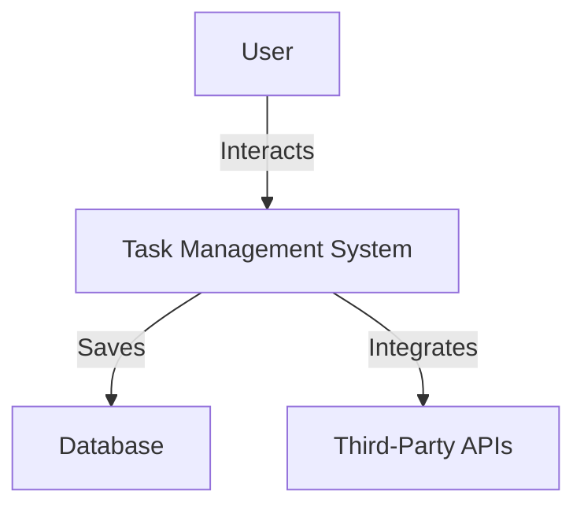
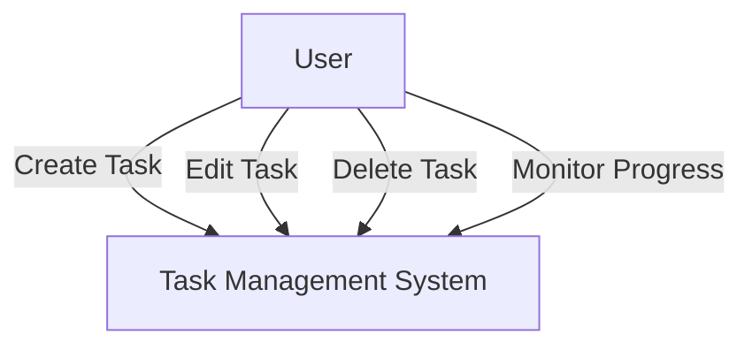
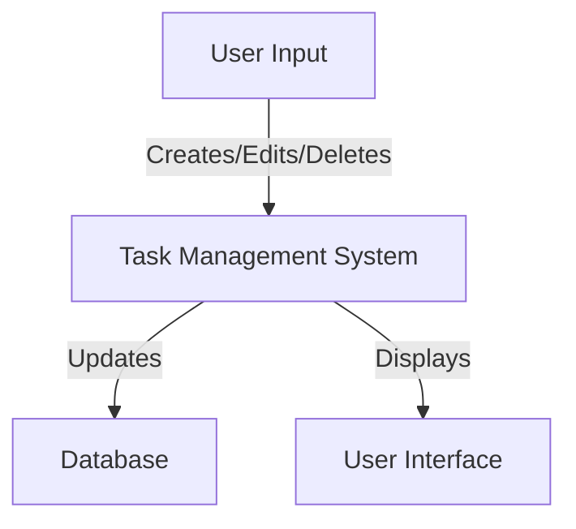

# Updated Software Requirements Specification (SRS) for Task Management System

## 1. Introduction
This Software Requirements Specification (SRS) document outlines the requirements for a web-based task management system designed to improve productivity for workers and managers. The document serves as a guide for developers and stakeholders to understand the functionalities, constraints, and expectations of the system. 

### 1.1 Purpose
The purpose of this SRS is to define the requirements for a task management system that allows users to create, edit, delete tasks, set deadlines and priorities, monitor task progress, and collaborate on tasks. This document aims to ensure that all stakeholders have a clear understanding of the system's objectives and functionalities.

### 1.2 Scope
The task management system will include the following features:
- User authentication and role management (workers and managers)
- Task creation, editing, and deletion
- Setting deadlines and priorities for tasks
- Monitoring task progress through status updates
- Commenting and collaboration features for tasks
- User-friendly interface for both web and mobile platforms

**Limitations/Exclusions**: The system will not include features for time tracking or billing, nor will it support integration with project management tools outside of the specified third-party APIs.

## 2. System Overview
The task management system is a web-based tool designed to facilitate task organization and collaboration among team members and project managers. It aims to streamline workflows and enhance productivity by providing a centralized platform for task management.

### 2.1 Personas
- **Workers (Team Members, Freelancers)**: Require a simple interface to create and manage their tasks, set deadlines, and collaborate with others.
- **Managers (Project Managers, Team Leads)**: Need oversight of team tasks, the ability to assign tasks, set priorities, and monitor progress.

### 2.2 Assumptions and Dependencies
- Users are assumed to have basic computer literacy and internet access.
- The system will depend on a stable internet connection for optimal performance.
- Integration with third-party tools (e.g., calendar applications) may be required.

**Impact of Assumptions**: If users lack basic computer literacy, additional training may be necessary, which could impact project timelines. If the internet connection is unstable, user experience may be negatively affected.

### 2.3 System Constraints
- The project must be completed within a 1-month timeframe.
- No specific budget constraints have been mentioned, but cost-effective solutions are preferred.

## 3. Functional Requirements
### 3.1 Feature: Task Management
#### 3.1.1 Use Case: Create Task
- **Actors**: Workers, Managers
- **Preconditions**: User is logged into the system.
- **Postconditions**: A new task is created and visible in the task list.

**Steps**:
1. User navigates to the task creation page.
2. User enters task details (title, description, deadline, priority).
3. User clicks "Create Task."
4. System saves the task and displays it in the task list.

**Acceptance Criteria**:
- The task must be saved successfully and displayed in the task list.
- The system must validate input data and provide error messages for invalid entries.

#### 3.1.2 Functionalities
- Users can input task details including title, description, deadline, and priority.
- The system validates input data and provides error messages for invalid entries.
- Users can assign tasks to themselves or other team members.

### 3.2 Feature: Edit Task
#### 3.2.1 Use Case: Edit Task
- **Actors**: Workers, Managers
- **Preconditions**: User is logged in and has access to the task.
- **Postconditions**: The task is updated with new details.

**Steps**:
1. User selects a task from the task list.
2. User clicks "Edit Task."
3. User modifies task details.
4. User clicks "Save Changes."
5. System updates the task and reflects changes in the task list.

**Acceptance Criteria**:
- The updated task must reflect the new details in the task list.

### 3.3 Feature: Delete Task
#### 3.3.1 Use Case: Delete Task
- **Actors**: Workers, Managers
- **Preconditions**: User is logged in and has access to the task.
- **Postconditions**: The task is removed from the task list.

**Steps**:
1. User selects a task from the task list.
2. User clicks "Delete Task."
3. System prompts for confirmation.
4. User confirms deletion.
5. System removes the task from the list.

**Acceptance Criteria**:
- The task must be removed from the task list upon confirmation.

## 4. Non-Functional Requirements (NFRs)
### 4.1 Performance
- The system should respond to user actions within 2 seconds under normal load.

### 4.2 Scalability
- The system should support up to 500 concurrent users without performance degradation.

### 4.3 Security
- User data must be encrypted and stored securely to prevent unauthorized access.
- Additional security measures, such as two-factor authentication, should be considered.

### 4.4 Availability and Reliability
- The system should have an uptime of 99.5% and include recovery protocols for data loss.

### 4.5 Usability
- The user interface should be intuitive and easy to navigate for all user personas.

### 4.6 Compliance and Legal Requirements
- The system must comply with data protection regulations such as GDPR.

## 5. External Interface Requirements
### 5.1 User Interfaces
- The system should provide a responsive design that adapts to various screen sizes and devices.

### 5.2 Software Interfaces
- Integration with third-party APIs for calendar and notification services.
- The expected behavior of the system when interacting with these APIs should be clearly defined, including error handling and data synchronization.

### 5.3 Communication Interfaces
- The system should use RESTful APIs for data exchange between components.

## 6. System Models
### 6.1 Context Diagram

### 6.2 Use Case Diagram

### 6.3 Data Flow Diagrams (DFDs)

## 7. Data Requirements
### 7.1 Data Retention and Archival
- Task data should be retained for a minimum of 5 years, with archival procedures in place for older data.
- Specific guidelines for accessing archived data should be established.

## 8. Other Requirements
### 8.1 Legal and Regulatory Requirements
- The system must comply with applicable data protection laws.

### 8.2 Operational Requirements
- Ongoing support and maintenance will be required post-launch.

### 8.3 Backup and Recovery
- Daily backups of the database should be performed, with a recovery plan in place for data restoration.

## 9. Appendices
### 9.1 Glossary
- **Task**: A unit of work assigned to a user.
- **User**: An individual who interacts with the task management system.
- **API**: Application Programming Interface.

### 9.2 Acronyms
- **NFR**: Non-Functional Requirements
- **API**: Application Programming Interface
- **GDPR**: General Data Protection Regulation

This updated SRS document serves as a comprehensive guide for the development of the task management system, ensuring that all requirements are clearly defined and understood by all stakeholders involved. The incorporation of review comments enhances clarity and completeness, providing a more robust framework for the project.